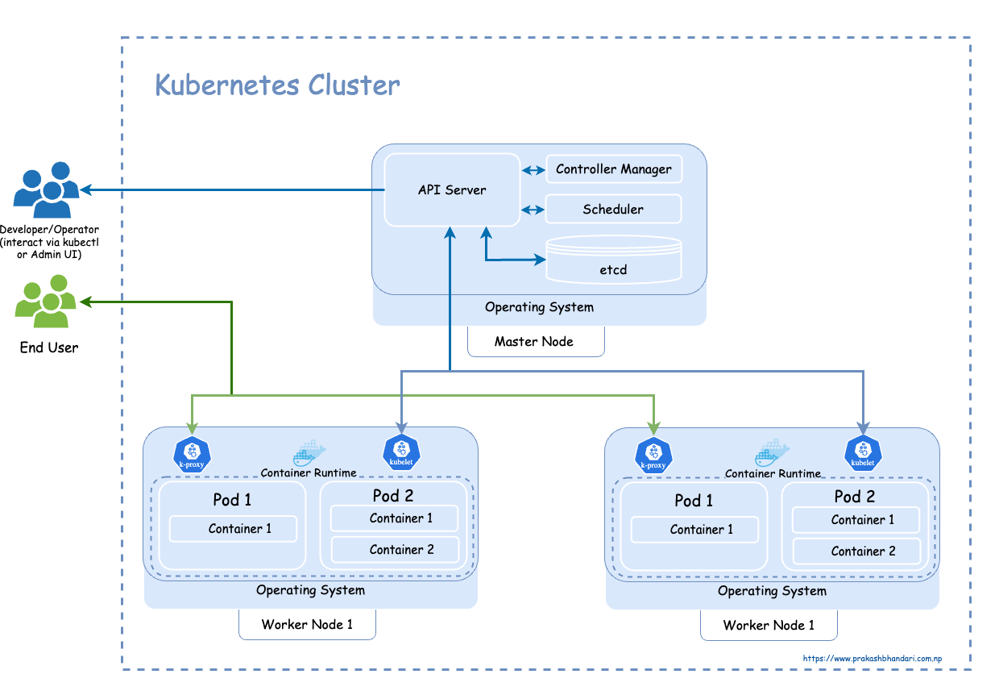
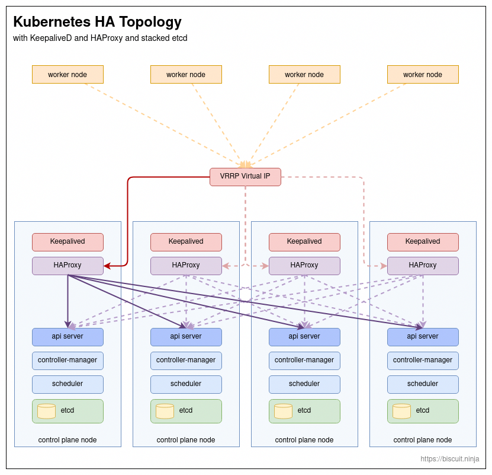
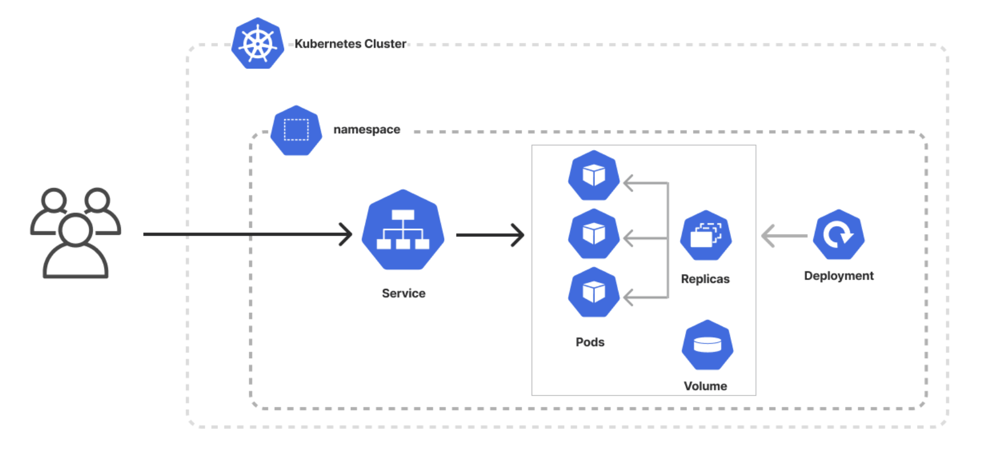
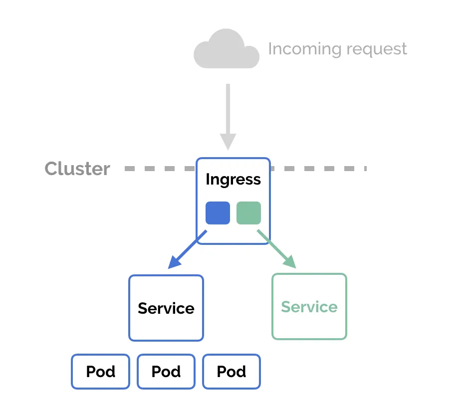

## 1) 왜 Kubernetes를 쓰나?

### 과거 흐름으로 이해하기

쿠버네티스가 등장한 배경을 시간 순서로 보면 더 이해가 쉽습니다.

1. **전통 배포(물리 서버/VM 중심)**  
   애플리케이션을 서버에 직접 설치하거나 VM 단위로 운영했습니다.  
   환경마다 설정 차이가 크고, 배포/복구가 느렸습니다.

2. **컨테이너 확산(Docker 대중화)**  
   "어디서나 동일하게 실행"되는 배포 단위가 생기면서 개발/배포가 빨라졌습니다.  
   하지만 컨테이너 수가 늘어나면 수동 운영이 한계에 부딪혔습니다.

3. **운영 문제 폭발**  
   - 장애 난 컨테이너를 누가 자동으로 다시 띄울지
   - 트래픽 증가 시 몇 개를 더 띄울지
   - 무중단에 가깝게 버전을 어떻게 교체할지
   - 여러 서버에 컨테이너를 어떻게 고르게 배치할지  
   이런 문제를 스크립트/사람이 직접 처리하기 어려워졌습니다.

4. **오케스트레이션 필요 -> Kubernetes**  
   Kubernetes는 위 문제를 "선언형 + 자동화"로 해결합니다.  
   즉, 원하는 상태를 선언하면 시스템이 계속 그 상태로 맞춥니다.

### 그래서 Kubernetes의 핵심 가치

- **자동 복구(Self-healing)**: 장애 Pod 자동 재생성
- **자동 확장(Scaling)**: 부하에 따라 Pod 수 증감
- **롤링 업데이트**: 배포 중 중단 최소화
- **서비스 디스커버리**: Service DNS 기반 내부 통신
- **선언형 운영**: 수동 절차보다 상태 중심 운영

### 단점/주의점

- 초기 학습 비용이 큼
- 네트워크/스토리지/보안까지 고려해야 함
- 클러스터 운영 자체도 하나의 시스템 운영 업무

---

## 2) 기본 구조(아키텍처) 한눈에 보기



위 그림을 함께 보면 Cluster/Control Plane/Worker Node/Pod/Service 관계를 더 빠르게 이해할 수 있습니다.

- **클러스터(Cluster)**: Kubernetes 전체 환경
- **컨트롤 플레인(Control Plane)**: 클러스터 제어 두뇌
- **워커 노드(Worker Node)**: 실제 앱(Pod)이 실행되는 서버

### Control Plane 주요 구성요소

- **kube-apiserver**: 모든 요청의 진입점 (명령을 받는 API 서버)
- **etcd**: 클러스터 상태를 저장하는 Key-Value DB
- **kube-scheduler**: 어떤 노드에 Pod를 배치할지 결정
- **kube-controller-manager**: 상태를 목표 상태로 맞추는 컨트롤러 실행

### Worker Node 주요 구성요소

- **kubelet**: 노드에서 Pod 상태를 관리
- **container runtime**: 실제 컨테이너 실행(containerd 등)
- **kube-proxy**: 서비스 네트워크 라우팅 처리

### HA Control Plane 토폴로지 (Keepalived + HAProxy + Stacked etcd)



위 구조는 고가용성(HA) 컨트롤 플레인을 구성할 때 자주 쓰는 형태입니다.

- 워커 노드는 직접 특정 마스터로 붙지 않고 **VRRP Virtual IP(VIP)** 로 API 요청을 보냅니다.
- 각 컨트롤 플레인 노드에서 **Keepalived**가 VIP 소유권을 관리하고, 장애 시 VIP를 다른 노드로 넘깁니다.
- **HAProxy**가 VIP로 들어온 트래픽을 여러 `kube-apiserver`로 분산합니다.
- 각 컨트롤 플레인 노드에 **etcd가 함께 있는 stacked etcd** 구성이며, etcd 멤버 간 동기화로 상태를 유지합니다.

즉, 특정 마스터가 내려가도 VIP failover + 다중 API 서버로 제어 평면을 계속 사용할 수 있게 만드는 방식입니다.

---

## 3) 꼭 알아야 할 핵심 개념

### Pod

쿠버네티스에서 배포되는 가장 작은 단위입니다.  
보통 컨테이너 1개를 담고, 필요하면 여러 컨테이너를 한 Pod에 넣을 수도 있습니다.

### Deployment

Pod를 안정적으로 관리하는 리소스입니다.

- 원하는 Pod 개수 유지
- 업데이트 전략(롤링 업데이트) 관리
- 장애 시 자동 재생성

비슷한 워크로드 리소스와의 차이(가볍게):

- **Deployment**: 일반 stateless 앱(웹/API)에 가장 많이 사용
- **StatefulSet**: Pod 이름/스토리지 순서를 보장해야 하는 stateful 앱(DB, 메시지 큐 등)에 사용
- **DaemonSet**: 모든 노드(또는 특정 노드 그룹)마다 1개씩 Pod를 배치할 때 사용(로그 수집기, 모니터링 에이전트 등)

### Service

Pod 앞단의 고정된 접근 지점입니다.  
Pod IP는 바뀌기 쉬우므로, 서비스 이름으로 접근하게 만듭니다.



그림 기준으로 보면 트래픽 흐름은 다음과 같습니다.

1. 사용자는 Service로 접근합니다.
2. Service는 라벨 셀렉터로 연결된 Pod들로 트래픽을 분산합니다.
3. Pod 개수(Replica)는 Deployment가 관리하고, 장애/스케일 시 바뀌어도 Service 진입점은 유지됩니다.

정리하면, **사용자는 고정된 Service만 바라보고**, 뒤쪽 Pod 교체/확장은 Kubernetes가 자동 처리합니다.

### 클러스터 내부 DNS (Service DNS)

쿠버네티스는 Service에 대해 내부 DNS 이름을 자동으로 만들어 줍니다.  
같은 클러스터 안에서는 IP 대신 DNS 이름으로 안정적으로 통신하는 것이 일반적입니다.

- 같은 네임스페이스에서 접근: `<service-name>`
- 다른 네임스페이스에서 접근: `<service-name>.<namespace>.svc.cluster.local`

예:

- `web-svc.default.svc.cluster.local`
- `prometheus-community-kube-prom-prometheus.monitoring.svc.cluster.local`

특히 Pod IP는 자주 바뀌므로, 내부 통신은 Service DNS를 기준으로 설계하는 것이 좋습니다.

### Namespace

클러스터 내부의 논리적 작업 공간입니다.  
팀/환경(dev, staging, prod) 분리에 자주 사용합니다.

### ConfigMap / Secret

- **ConfigMap**: 일반 설정값 저장
- **Secret**: 비밀번호/토큰 같은 민감정보 저장 (Base64 인코딩 기반)

### Ingress

외부 HTTP/HTTPS 요청을 클러스터 내부 서비스로 라우팅하는 규칙입니다.  
보통 Ingress Controller(예: ingress-nginx)와 함께 사용합니다.

### Resources (requests / limits)

Pod(정확히는 컨테이너)의 CPU/메모리 사용 기준을 정의하는 설정입니다.

- **requests**: 스케줄링 시 "최소 이 정도 자원은 필요"하다는 기준
- **limits**: 컨테이너가 사용할 수 있는 최대 자원 한도
- `requests`를 실제 사용량에 가깝게 설정하면 Pod 배치가 효율적이 되어 서버 리소스를 더 촘촘하게 활용할 수 있습니다.

---

## 4) 용어 해석 사전 (영어 -> 한국어)

- **Desired State**: 목표 상태 (원하는 상태)
- **Actual State**: 현재 상태
- **Reconcile**: 목표 상태와 현재 상태를 맞추는 과정
- **Manifest**: 리소스 정의 파일(YAML)
- **Rollout**: 배포 진행 과정
- **Rollback**: 이전 버전으로 되돌리기
- **Scale**: Pod 수 확장/축소
- **Drift**: 선언 상태와 실제 상태가 어긋난 상황
- **Taint / Toleration**: 특정 노드 스케줄 제한/허용 규칙
- **Affinity / Anti-affinity**: Pod 배치 선호/회피 규칙
- **Service Discovery**: 서비스 이름(DNS)으로 서로를 찾는 방식

---

## 5) YAML을 볼 때 읽는 순서

쿠버네티스 YAML은 처음엔 복잡해 보이지만 아래 순서로 보면 쉽습니다.

1. `apiVersion`: 어떤 API 그룹/버전인지
2. `kind`: 어떤 리소스인지(Deployment, Service 등)
3. `metadata`: 이름, 네임스페이스, 라벨
4. `spec`: 원하는 상태(핵심 설정)

추가로 처음 볼 때 헷갈리는 문법 포인트:

- 들여쓰기(스페이스)가 구조를 결정합니다. 탭 대신 스페이스를 사용합니다.
- `-`는 리스트 항목(배열)입니다. 예: `containers`, `ports`, `rules`
- `key: value`는 맵(객체)입니다.
- `status`는 보통 사용자가 작성하지 않고, 클러스터가 채우는 실제 상태 필드입니다.

### `metadata`에서 자주 보는 필드

- `name`: 리소스 이름
- `namespace`: 리소스가 속한 네임스페이스
- `labels`: 선택/그룹핑용 키-값 (Service selector, 조회 필터에 사용)
- `annotations`: 동작 힌트/메타데이터 (Ingress, Argo CD 옵션 등)

### `spec` 내부는 `kind`마다 달라진다

같은 `spec`이라도 리소스 종류에 따라 의미가 다릅니다.

- **Deployment.spec**
  - `replicas`: 원하는 Pod 개수
  - `selector.matchLabels`: 어떤 Pod를 이 Deployment가 관리할지
  - `template`: 생성할 Pod의 템플릿
  - `strategy`: 업데이트 방식(기본 RollingUpdate)
- **Pod 템플릿(Deployment.spec.template.spec)**
  - `containers[].image`: 실행할 컨테이너 이미지
  - `containers[].ports`: 컨테이너 포트
  - `containers[].env / envFrom`: 환경변수 주입
  - `containers[].resources`: requests/limits
  - `containers[].readinessProbe / livenessProbe`: 헬스체크
  - `volumes / volumeMounts`: 스토리지 마운트
- **Service.spec**
  - `selector`: 트래픽 보낼 Pod 라벨
  - `ports[].port`: 서비스 포트
  - `ports[].targetPort`: Pod(컨테이너) 포트
  - `type`: `ClusterIP`, `NodePort`, `LoadBalancer`
- **Ingress.spec**
  - `ingressClassName`: 사용할 Ingress Controller
  - `rules[].host/path`: 라우팅 규칙
  - `backend.service.name/port`: 최종 연결 대상 Service
  - `tls`: HTTPS 인증서 설정

예시:

```yaml
apiVersion: apps/v1
kind: Deployment
metadata:
  name: web
  namespace: default
spec:
  replicas: 3
  selector:
    matchLabels:
      app: web
  template:
    metadata:
      labels:
        app: web
    spec:
      containers:
        - name: nginx
          image: nginx:1.27
          ports:
            - containerPort: 80
          readinessProbe:
            httpGet:
              path: /
              port: 80
            initialDelaySeconds: 5
            periodSeconds: 5
          livenessProbe:
            httpGet:
              path: /
              port: 80
            initialDelaySeconds: 10
            periodSeconds: 10
          resources:
            requests:
              cpu: 100m
              memory: 128Mi
            limits:
              cpu: 300m
              memory: 256Mi
```

해석:

- `web`라는 Deployment를 만들고
- `nginx:1.27` Pod를
- 항상 3개 유지한다는 의미입니다.

실무에서는 아래처럼 같이 보면 이해가 빨라집니다.

```bash
# 해당 kind에서 spec에 어떤 필드가 가능한지 확인
kubectl explain deployment.spec
kubectl explain deployment.spec.template.spec.containers
kubectl explain service.spec
kubectl explain ingress.spec
```

### Deployment + Service + Ingress(ingress-nginx) 연결 예제

아래 예제는 `web` 애플리케이션을 외부에서 `demo.local` 도메인으로 접근하게 만드는 가장 기본적인 흐름입니다.



그림을 기준으로 보면 요청 흐름은 다음과 같습니다.

1. 외부 요청이 `Ingress`로 들어옵니다.
2. `Ingress`가 규칙(`host`, `path`)에 따라 `Service`로 전달합니다.
3. `Service`는 selector로 매칭된 Pod들로 트래픽을 분산합니다.
4. Pod 수와 교체 전략은 `Deployment`가 관리합니다.

사전 조건:

- 클러스터에 `ingress-nginx` 컨트롤러가 설치되어 있어야 합니다.
- 로컬 테스트 시 `/etc/hosts`에 Ingress 진입 IP를 매핑해야 할 수 있습니다.

```yaml
apiVersion: apps/v1
kind: Deployment
metadata:
  name: web-deploy
  namespace: default
spec:
  replicas: 2
  selector:
    matchLabels:
      app: web-app
  template:
    metadata:
      labels:
        app: web-app
    spec:
      containers:
        - name: nginx
          image: nginx:1.27
          ports:
            - containerPort: 80
---
apiVersion: v1
kind: Service
metadata:
  name: web-svc
  namespace: default
spec:
  selector:
    app: web-app
  ports:
    - port: 80
      targetPort: 80
  type: ClusterIP
---
apiVersion: networking.k8s.io/v1
kind: Ingress
metadata:
  name: web-ingress
  namespace: default
  annotations:
    nginx.ingress.kubernetes.io/rewrite-target: /
spec:
  ingressClassName: nginx
  rules:
    - host: demo.local
      http:
        paths:
          - path: /
            pathType: Prefix
            backend:
              service:
                name: web-svc
                port:
                  number: 80
```

적용/검증:

```bash
# 1) 예제 파일 적용
kubectl apply -f web-example.yaml

# 2) 리소스 생성 확인
kubectl get deploy,svc,ing -n default

# 3) Ingress 주소 확인
kubectl get ingress web-ingress -n default

# 4) 앱 응답 확인
curl -H "Host: demo.local" http://<INGRESS_IP>/
```

해석:

- `Deployment(web-deploy)`가 라벨 `app=web-app`인 Pod를 2개 유지합니다.
- `Service(web-svc)`는 **Ready 상태인 Pod**로만 트래픽을 전달합니다.
- `Ingress(web-ingress)`가 `demo.local` 요청을 `web-svc:80`으로 라우팅합니다.
- `readinessProbe`는 서비스 트래픽 수신 가능 여부를 판단하고, `livenessProbe`는 비정상 Pod를 재시작합니다.
- `resources.requests/limits`는 스케줄링 기준과 최대 사용량을 정의해 자원 과사용을 방지합니다.

---

## 6) 많이 사용하는 `kubectl` 명령어

아래 명령어만 익혀도 초반 운영/디버깅이 훨씬 쉬워집니다.

### 7-1. 현재 상태 조회

```bash
# 노드 목록
kubectl get nodes

# 네임스페이스 목록
kubectl get ns

# 특정 네임스페이스의 Pod 목록
kubectl get pods -n <namespace>

# 서비스 목록
kubectl get svc -n <namespace>

# 배포(Deployment) 목록
kubectl get deploy -n <namespace>
```

### 7-2. 상세 정보 확인(문제 분석)

```bash
# Pod 상세 상태 (이벤트 포함)
kubectl describe pod <pod-name> -n <namespace>

# Deployment 상세 상태
kubectl describe deploy <deploy-name> -n <namespace>

# 최근 이벤트 확인
kubectl get events -n <namespace> --sort-by=.lastTimestamp
```

### 7-3. 로그 확인

```bash
# Pod 로그 보기
kubectl logs <pod-name> -n <namespace>

# 실시간 로그 팔로우
kubectl logs -f <pod-name> -n <namespace>

# 다중 컨테이너 Pod일 때 컨테이너 지정
kubectl logs <pod-name> -c <container-name> -n <namespace>
```

### 7-4. 리소스 적용/삭제

```bash
# YAML 적용 (생성/수정)
kubectl apply -f <file-or-dir>

# 리소스 삭제
kubectl delete -f <file-or-dir>
```

### 7-5. 스케일/재시작/롤아웃

```bash
# Deployment Pod 수 조정
kubectl scale deploy <deploy-name> --replicas=3 -n <namespace>

# 롤아웃 상태 확인
kubectl rollout status deploy/<deploy-name> -n <namespace>

# 롤아웃 히스토리 확인
kubectl rollout history deploy/<deploy-name> -n <namespace>

# 롤아웃 재시작
kubectl rollout restart deploy/<deploy-name> -n <namespace>

# 이전 버전으로 롤백
kubectl rollout undo deploy/<deploy-name> -n <namespace>
```

### 7-6. 클러스터 내부 접속/테스트

```bash
# Pod 내부 셸 접속
kubectl exec -it <pod-name> -n <namespace> -- /bin/sh

# 로컬 포트를 Pod/Service에 연결
kubectl port-forward pod/<pod-name> 8080:80 -n <namespace>
kubectl port-forward svc/<service-name> 8080:80 -n <namespace>
```

### 7-7. 파일/설정 관련

```bash
# 현재 컨텍스트 확인
kubectl config current-context

# 컨텍스트 목록 확인
kubectl config get-contexts

# 사용 가능한 API 리소스 목록
kubectl api-resources

# 리소스 YAML 출력(실제 적용 상태)
kubectl get deploy <deploy-name> -n <namespace> -o yaml
```

---

## 7) 처음 공부할 때 추천 순서

1. Pod -> Deployment -> Service
2. ConfigMap/Secret
3. Ingress
4. Volume/PVC
5. Helm
6. GitOps(Argo CD, Flux)

이 순서대로 가면 "왜 이런 도구가 필요한지"가 자연스럽게 연결됩니다.

	•	Pod IP를 직접 쓰면 왜 불안정할까?
	•	Deployment 없이 Pod만 직접 만들면 뭐가 힘들까?
	•	Service는 Pod를 어떻게 찾을까?
	•	Ingress가 있으면 Service는 왜 또 필요할까?
	•	Helm은 YAML을 없애주는 도구일까, 아니면 YAML을 만들기 쉽게 해주는 도구일까?
	•	kubeadm init 후 바로 모든 게 되는 게 아니라 CNI가 왜 꼭 필요할까?
	•	왜 나중에는 kubectl apply보다 GitOps가 더 낫다고 할까?
